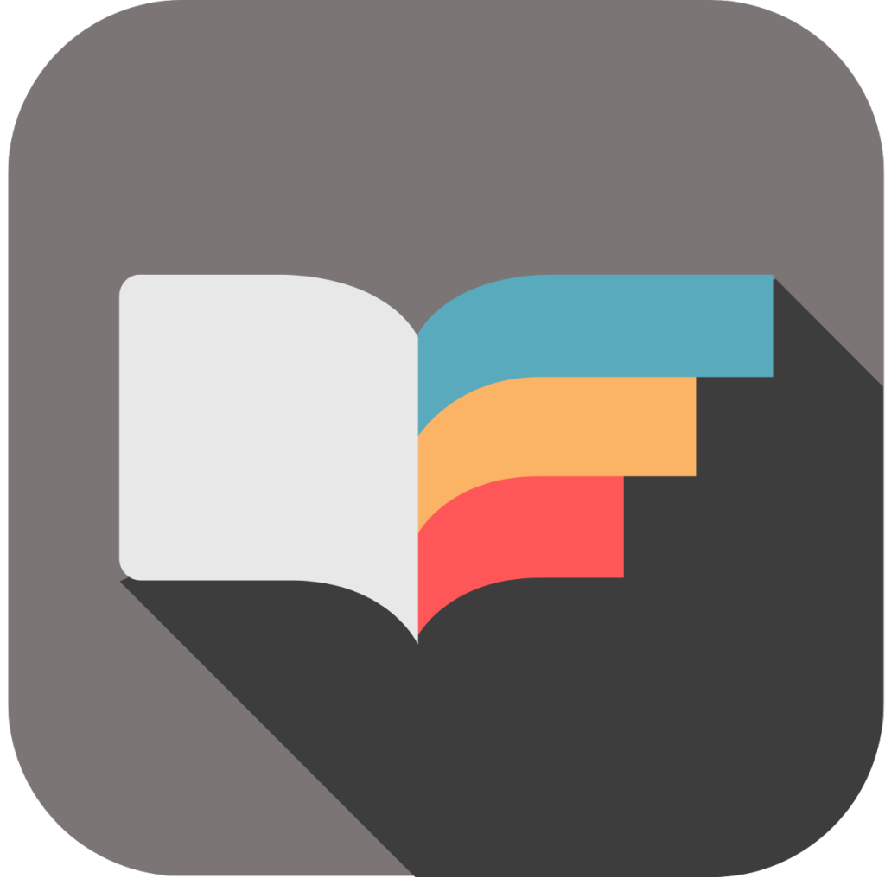

[![Contributors][contributors-shield]][contributors-url]
[![Forks][esgi-shield]][esgi-url]
[![LinkedIn][linkedin-shield-victor]][linkedin-url-victor]
[![LinkedIn][linkedin-shield-elisa]][linkedin-url-elisa]
[![LinkedIn][linkedin-shield-taj]][linkedin-url-taj]
[![PlayStore][android-shield]][android-url]
[![AppStore][ios-shield]][ios-url]
[](https://codemagic.io/apps/60d3808dab5163bb06eda2b8/60ddbd3717ecbd054d86bba0/latest_build)

<!-- PROJECT LOGO -->
<br />
<p align="center">
  <a href="https://github.com/BookAppPA">
    
  </a>

  <h3 align="center">BookWorm Flutter</h3>

  <p align="center">
    An Awesome Book Social Media made in Flutter!
    <br />
    <a href="https://github.com/BookAppPA/MobileApp/blob/main/README.md"><strong>Explore the docs »</strong></a>
    <br />
    <br />
    ·
    <a href="https://github.com/BookAppPA/MobileApp/issues">Report Bug</a>
    ·
    <a href="https://github.com/BookAppPA/MobileApp/issues">Request Feature</a>
    ·
  </p>
</p>


<!-- TABLE OF CONTENTS -->
  <summary>Table of Contents</summary>
  <ol>
    <li>
      <a href="#about-the-project">About The Project</a>
      <ul>
        <li><a href="#built-with">Built With</a></li>
      </ul>
    </li>
    <li>
      <a href="#getting-started">Getting Started</a>
      <ul>
        <li><a href="#prerequisites">Prerequisites</a></li>
        <li><a href="#installation">Installation</a></li>
      </ul>
    </li>
    <li><a href="#usage">Usage</a></li>
    <li><a href="#roadmap">Roadmap</a></li>
    <li><a href="#contributing">Contributing</a></li>
    <li><a href="#license">License</a></li>
    <li><a href="#contact">Contact</a></li>
    <li><a href="#acknowledgements">Acknowledgements</a></li>
  </ol>


<!-- ABOUT THE PROJECT -->
## About The Project

[![BookWorm Screen Shot][product-screenshot]]

This project is a starting point for a Flutter application.

A few resources to get you started if this is your first Flutter project:

- [Lab: Write your first Flutter app](https://flutter.dev/docs/get-started/codelab)
- [Cookbook: Useful Flutter samples](https://flutter.dev/docs/cookbook)

For help getting started with Flutter, view our
[online documentation](https://flutter.dev/docs), which offers tutorials,
samples, guidance on mobile development, and a full API reference.

### Built With

This section should list any major frameworks that you built your project using. Leave any add-ons/plugins for the acknowledgements section. Here are a few examples.
* [Flutter](https://flutter.dev/)
* [Firebase](https://firebase.google.com/)
* [NodeJS](https://nodejs.org/en/)


<!-- GETTING STARTED -->
## Getting Started

This is an example of how you may give instructions on setting up your project locally.
To get a local copy up and running follow these simple example steps.

### Prerequisites

This is an example of how to list things you need to use the software and how to install them.
* npm
  ```sh
  npm install npm@latest -g
  ```

### Installation

1. Get a free API Key at [https://example.com](https://example.com)
2. Clone the repo
   ```sh
   git clone https://github.com/your_username_/Project-Name.git
   ```
3. Install NPM packages
   ```sh
   npm install
   ```
4. Enter your API in `config.js`
   ```JS
   const API_KEY = 'ENTER YOUR API';
   ```


<!-- USAGE EXAMPLES -->
## Usage

Use this space to show useful examples of how a project can be used. Additional screenshots, code examples and demos work well in this space. You may also link to more resources.

_For more examples, please refer to the [Documentation](https://example.com)_


<!-- ROADMAP -->
## Roadmap

See the [open issues](https://github.com/othneildrew/Best-README-Template/issues) for a list of proposed features (and known issues).


<!-- CONTRIBUTING -->
## Contributing

Contributions are what make the open source community such an amazing place to be learn, inspire, and create. Any contributions you make are **greatly appreciated**.

1. Fork the Project
2. Create your Feature Branch (`git checkout -b feature/AmazingFeature`)
3. Commit your Changes (`git commit -m 'Add some AmazingFeature'`)
4. Push to the Branch (`git push origin feature/AmazingFeature`)
5. Open a Pull Request


<!-- LICENSE -->
## License

Distributed under the MIT License. See `LICENSE` for more information.


<!-- CONTACT -->
## Contact

Taj Singh - tsingh@myges.fr

Victor Deyanovitch - vdeyanovitch@myges.fr

Elisa Gougerot - egougerot@myges.fr

<!-- ACKNOWLEDGEMENTS -->
## Acknowledgements
* [ReadMe Template](https://github.com/othneildrew/Best-README-Template/blob/master/README.md#contributing)


<!-- MARKDOWN LINKS & IMAGES -->
<!-- https://www.markdownguide.org/basic-syntax/#reference-style-links -->
[android-shield]: https://img.shields.io/badge/Android-Store-brightgreen
[android-url]: https://play.google.com/store/apps?hl=fr&gl=US
[ios-shield]: https://img.shields.io/badge/iOS-Store-lightgrey
[ios-url]: https://www.apple.com/fr/itunes/
[contributors-shield]: https://img.shields.io/github/contributors/BookAppPA/MobileApp?color=%23ECECE5&logo=BookWorm&logoColor=%23000&style=socia
[contributors-url]: https://github.com/BookAppPA/MobileApp/graphs/contributors
[esgi-shield]: https://img.shields.io/badge/ESGI-PA-blue
[esgi-url]: https://www.esgi.fr/
[linkedin-shield-victor]: https://img.shields.io/badge/LinkedIn-Victor-blue
[linkedin-url-victor]: https://linkedin.com/in/othneildrew
[linkedin-shield-elisa]: https://img.shields.io/badge/LinkedIn-Elisa-blue
[linkedin-url-elisa]: https://linkedin.com/in/othneildrew
[linkedin-shield-taj]: https://img.shields.io/badge/LinkedIn-Taj-blue
[linkedin-url-taj]: https://www.linkedin.com/in/tajsingh1596
[product-screenshot]: assets/logo.png